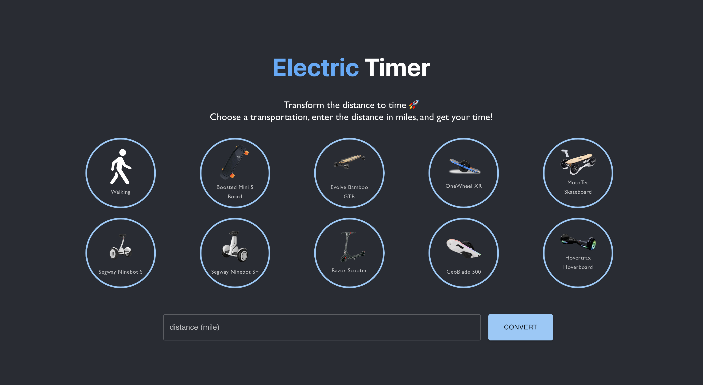
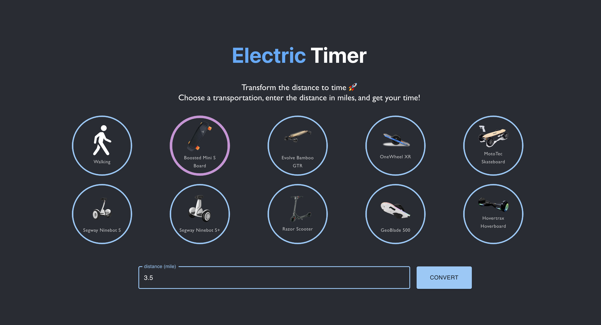
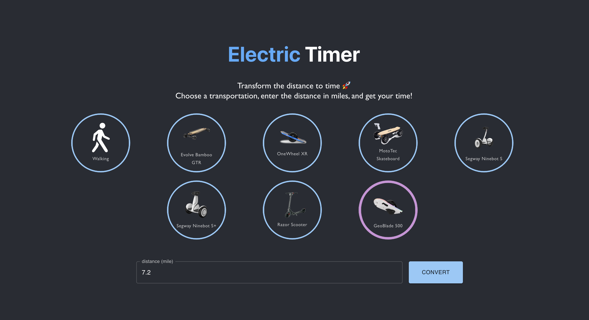
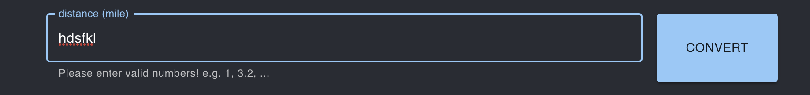
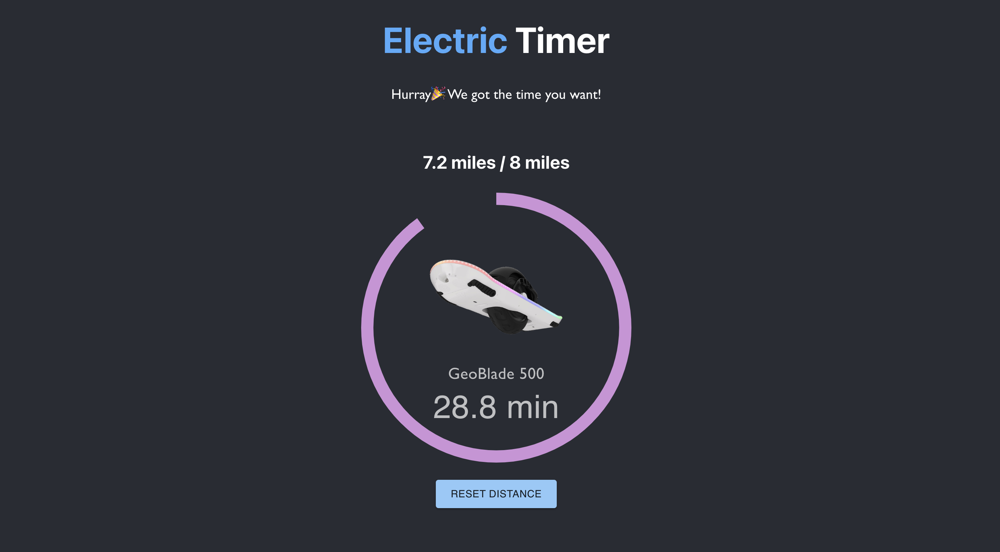
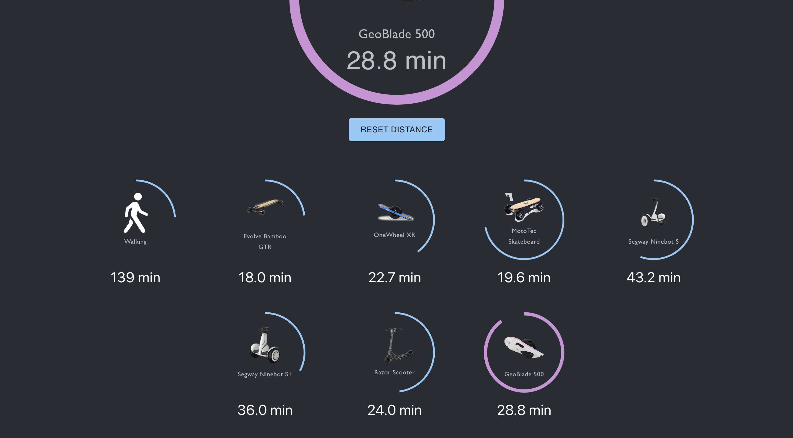
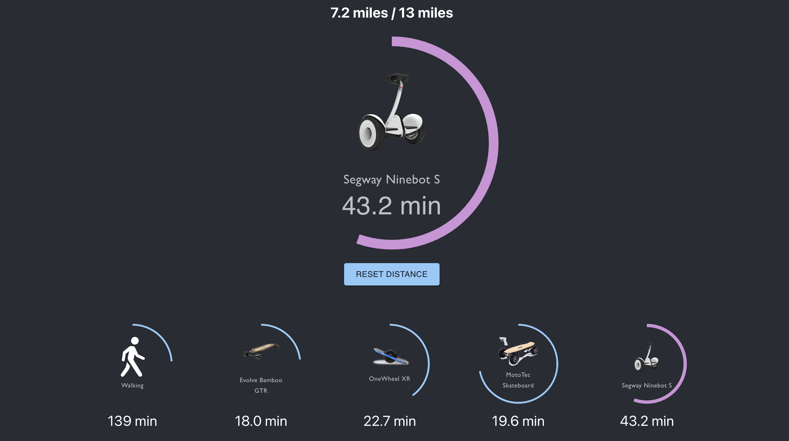

# Readme for Electric Timer


This is a frontend web application which, given an input of a desired distance to travel and a type of personal transportation, the user is able to see how much time it will take to travel that distance using the selected type of transportation, as well as the equivalent amount of time using a different mode of transportation for comparison.

 

## Basics
1. Author & Developer: Chuanyu Pan (chuanyu_pan@berkeley.edu)
2. Link to the code: https://github.com/pptrick/Electric-Timer-Webapp
3. Link to the video: https://youtu.be/U2kaktl7N7E

## Get Started

First clone this repo with:
```bash
git clone git@github.com:pptrick/Electric-Timer-Webapp.git
cd Electric-Timer-Webapp
```

Then use `npm` to install all the dependencies.
```bash
npm install
```

Finally, you can use these command to run the application:
### `npm start`

Runs the app in the development mode.\
Open [http://localhost:3000](http://localhost:3000) to view it in your browser.

The page will reload when you make changes.\
You may also see any lint errors in the console.

### `npm test`

Launches the test runner in the interactive watch mode.\
See the section about [running tests](https://facebook.github.io/create-react-app/docs/running-tests) for more information.

### `npm run build`

Builds the app for production to the `build` folder.\
It correctly bundles React in production mode and optimizes the build for the best performance.

The build is minified and the filenames include the hashes.\
Your app is ready to be deployed!

See the section about [deployment](https://facebook.github.io/create-react-app/docs/deployment) for more information.

### `npm run eject`

**Note: this is a one-way operation. Once you `eject`, you can't go back!**

If you aren't satisfied with the build tool and configuration choices, you can `eject` at any time. This command will remove the single build dependency from your project.

Instead, it will copy all the configuration files and the transitive dependencies (webpack, Babel, ESLint, etc) right into your project so you have full control over them. All of the commands except `eject` will still work, but they will point to the copied scripts so you can tweak them. At this point you're on your own.

You don't have to ever use `eject`. The curated feature set is suitable for small and middle deployments, and you shouldn't feel obligated to use this feature. However we understand that this tool wouldn't be useful if you couldn't customize it when you are ready for it.

## Functionality

1. The initial page of this application shows in the following figure. A big title 'Electric Timer' is shown at the top ofthe page, and an instruction follows. Then followed by a few icons of different transportation with their names. There's an input text-field and a 'convert' button at the bottom of the page.
 
2. User can choose a transportation by clicking on the icon. If selected, the icon will be highlighted. In this case we choose Boosted Mini S Board. The user can then enter the distance in the text field, in this case is 3.5 miles.
 
3. The page will only show the transportation whose range is greater than the input distance. If the input distance is larger than a transportation's range, it's icon will disappear automatically. For example, we can see from the following figure that there're only 8 options if we enter 7.2 miles in distance.
 
4. If the user input anything other than valid numbers, warnings will appeared. Either invalid numbers, no selections, no input distance will cause the CONVERT button to be invalid.
 
5. Choose 'GeoBlade 500' and enter 7.2 miles, click 'CONVERT' button, we will jump to the result page. (It is implemented in the same page). A large icon shown at the center of the page, showing the time and the distance of the selected transportation. The circle progress bar shows the proportion of the input distance to the range of the transportation. 
 
6. Scroll down the page you will see the comparison of other transportation. Same as before, the page only shows the transportation whose range is greater than the input distance.
 
7.  If the user click on other icons, the transportation will be selected and shows in the large icon.
 
8. Click the 'RESET DISTANCE' button and we will go back to the initial page with everything reset.

## License
This code and model are available for scientific research and education purposes as defined in the LICENSE file (MIT License). By downloading and using the code and model you agree to the terms in the LICENSE.

